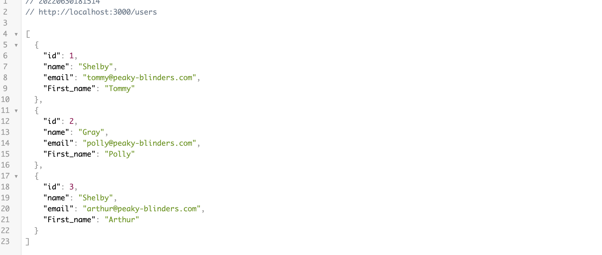

# Peaky-Blinders-API
Simple NodeJS CRUD rest API in Node Js using PostgreSql for the Shelby company

This is a local project.

## Author
I used the tutorial available here : https://blog.logrocket.com/crud-rest-api-node-js-express-postgresql/
Author : Tania Rascia 
Author 2 : Timothée Marguier (Adding a remote file to hide database connexion js file, adding a column in the database)